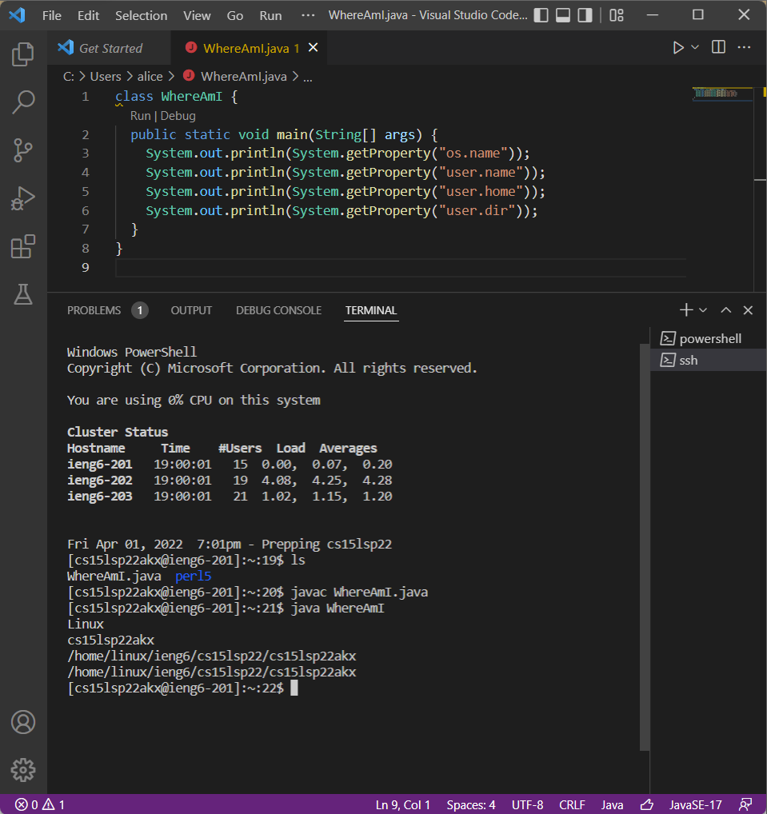

# Lab Report 1
## 1. Installing VScode ##
The first step in logging into our ieng6 account is to install [Visual Studio Code](https://code.visualstudio.com/download). After downloading VScode, you should open the application and see something like this:


## 2. Remotely Connecting ##
To remotely connect, make sure to have [OpenSSH](https://docs.microsoft.com/en-us/windows-server/administration/openssh/openssh_install_firstuse) installed on your computer (can disregard if you are on MacOS). The information we need for this next step is your course specific account, which can be found [here](https://sdacs.ucsd.edu/~icc/index.php).

Now, type this following statement into your VScode terminal:

``` 
 $ ssh cs15lsp22<username>@ieng6.ucsd.edu 
 ```
 You will see something like this in your terminal after entering your password:

 

## 3. Trying Some Commands ##
Now that we are logged into the remote server, we can try some different commands. The ones shown below are: *ls* (list files), *ls -a* (list files including hidden), and *pwd* (print working directory). 


Some other ones you may want to try out are *cd*, *cat*, *mkdir*, and *cp*.

## 4. Moving Files with scp ##
Start by creating a new Java file, name it `WhereAmI.java`. Copy the contents of [this page](WhereAmI.md) into your file. 
Now, run the following commands (if you have Java installed):
```Java
javac WhereAmI.java
java WhereAmI
```
Then, type this command to copy this file into the remote server:
```
scp WhereAmI.java cs15lsp22<username>@ieng6.ucsd.edu:~/
```
Running the *ls* command on the ieng6 account should output something like this, showing that the file `WhereAmI.java` has been successfully copied over to the home directory.


## 5. Setting an SSH Key ##
Setting an SSH Key will allow us to login to ieng6 without needing a password. We will use the `ssh-keygen` command for this (press enter when prompted to type passphrase).

Now, try logging into ieng6 again using ssh, and you should be able to go in without needing to enter a password.


## 6. Optimizing Remote Running ##
We can optimize remote running and save keystrokes. For example, we are able to copy a file into the home directory and access the contents of it just by entering the following:
```Java
scp WhereAmI.java cs15lsp22<username>@ieng6.ucsd.edu
ssh cs15lsp22<username>@ieng6.ucsd.edu "javac WhereAmI.java; java WhereAmI"
```

